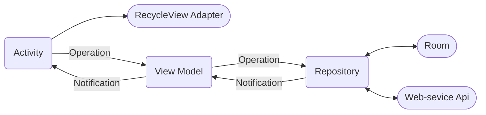

# Social Media - Android client
This is the code part of the social media android client in our project. You can find the [API server & web client](https://github.com/MeitarTeper/SocialMedia) and the [TCP server](https://github.com/MeitarTeper/SocialMedia-TCP-Server) in a different repesatories.

For further explanation please open the main repository of this project- the [API server & web client](https://github.com/MeitarTeper/SocialMedia).

## Executing The Program
To run the android client, open the android studio app on the android client folder. make sure that your android sdk has a correct config, and run it from there (of course you can run it both on an emulator, a phisycal device).
- Please make sure that the TCP server and the API server is running first. It won't work without it.

## Design
### Android Client workflow

Our Android client mirrors the web client's functionality, distinguished by its refined design employing the MVVM architecture.
The app utilizing a local Room database. This  plays a crucial role in enhancing the user experience by providing seamless access to data even in offline scenarios. 

# What can you do?
## log in and register
First, you need to click on the sign up for FooBar button that will navigate you to the register page were you can create an account.
make sure you fill your personal information correctly!

After you register you can log-in and use FooBar, make sure you fill your personal information correctly

## The FooBar feed
After you log-in you will be navigate to your feed. 

* You can like and unlike a post, etc.
* You can see the comment and the share menu.

### Edit user
* You can edit your user name and picture if you click on the  menu.

### Posts
* You can add, edit and delete posts only if the posts is yours.

* If your post contain link or URL which is not safe - a message will be displayed to the user and the post will not be uploaded or updated.

### Comments
* You can add, edit and delete comments only if the comments is yours. 

### Log-out and delete account
* You can log out or delete your account if you click on the menu.

### light mood to dark mood
* You can change light mood to dark mood if you click on the sun img on the top of the screen.

### Friends requests
* You can see your friends requests list if you click on the friends requests button that in the bottom menu. There you can also approve or decline the requests.

## Profile page
### Your profile page
* You can navigate to your profile page by clicking your user.
There, you can see your friends and your posts

### Friends profile page
* You can click on the name or picture in each post and get to the personal profile page of the author of the post, where you can also send a friend request or if you are already friends - see the user posts, friends list and an option to delete the user from your friend list.

## Application authors 
[Shahar Chen](https://github.com/Shahar2612)  
[Yaara Sirkis](https://github.com/YaaraSirkis)  
[Meitar Teper](https://github.com/MeitarTeper) 
